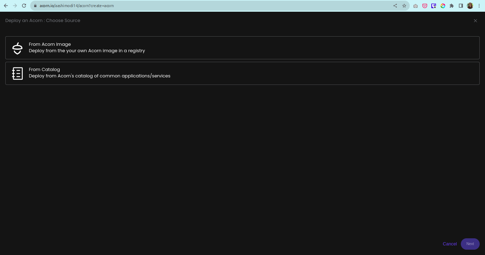
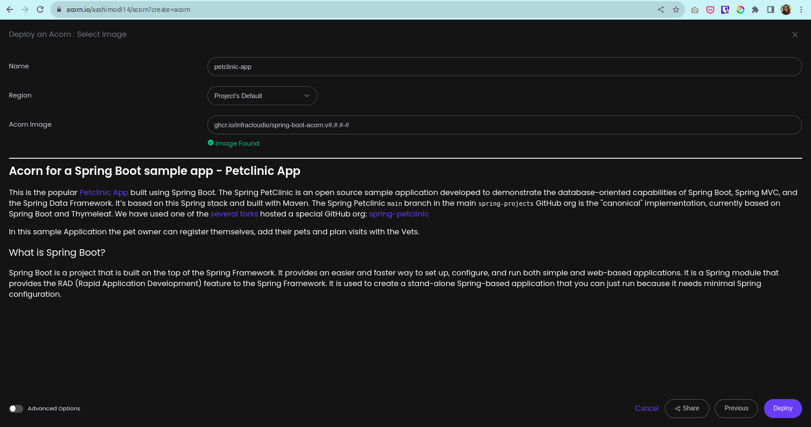
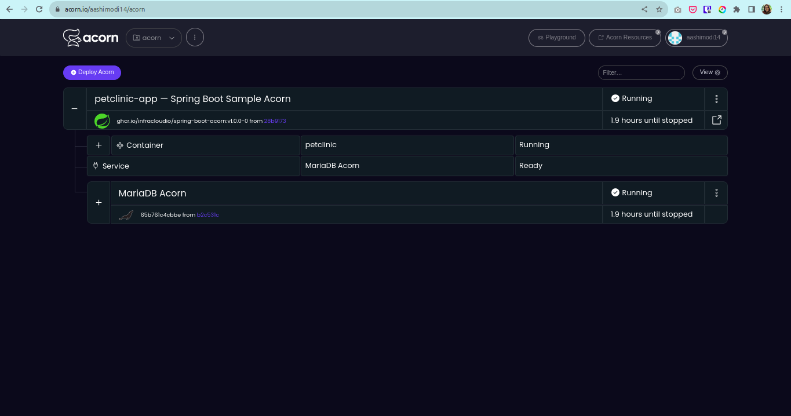
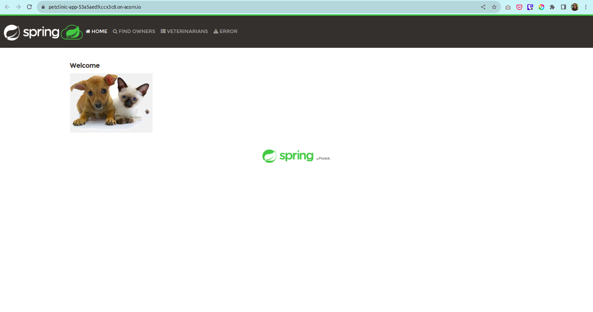

# Deploying Spring Boot - Petclinic App on Acorn

Ready to build something awesome? Enter [Spring Boot](https://spring.io/projects/spring-boot) – the superhero of frameworks! Spring Boot paired with Kubernetes, simplifies orchestration, enhancing developer productivity. This synergy streamlines development, secures applications, and aligns seamlessly with modern containerization trends.

One of the most popular app developed by the Spring Framework developers to demonstrate the capabilities of Spring Boot, Spring MVC, and Spring Data Framework is the [Spring Petclinic App](https://github.com/spring-petclinic). The Spring Petclinic App community is very active and there are [several forks](https://spring-petclinic.github.io/docs/forks.html) in the GitHub org [spring-petclinic](https://github.com/spring-petclinic). The Petclinic App is trying to solve a very crucial problem to provide Pets with Veterinary Care. The users can register their Pets and plan visits with their Vets to ensure their Pets well-being. To showcase this legendary application, we have deployed it on Acorn by simply as defining it with an [Acornfile](https://docs.acorn.io/reference/acornfile), generating a deployable Acorn Image. [Acorn](https://docs.acorn.io/) simplifies the building and provisioning of your containerised applications, which further provides a unique feature to share your artifacts and workloads using a link providing access to single-click deployment in a sandbox environment.  

If you want to check out the Petclinic Acorn for yourself, click the below link. All you need is a GitHub ID to create an account.

[](https://acorn.io/run/ghcr.io/infracloudio/spring-boot-acorn:v1.0.0-0?ref=aashimodi14&name=petclinic-app)

To know more about how we created the Spring Petclinic App Acorn, follow along. This tutorial will enable you to make customisations in the app or you can take it up a notch and deploy an Acorn for your very own Spring Boot app.

> _Note: Everything shown in this tutorial can be found in [this repository](https://github.com/infracloudio/spring-boot-acorn)_.
## Pre-requisites

- Acorn CLI: The CLI allows you to interact with the Acorn Runtime as well as Acorn to deploy and manage your applications. Refer to the [Installation documentation](https://docs.acorn.io/installation/installing) to install Acorn CLI for your environment.
- A GitHub account is required to sign up and use the Acorn Platform.

## Acorn Login

Log in to the [Acorn Platform](https://acorn.io) using the GitHub Sign-In option with your GitHub user.


After the installation of Acorn CLI for your OS, you can login to the Acorn platform.

```sh
$ acorn login
```

## Deploying the Spring Boot Petclinic App

There are two ways to deploy Spring Petclinic App on Acorn Platform.

1. Using Acorn platform dashboard.
2. Using CLI

The Acorn Dashboard way is the easiest one where, in just a few clicks you can deploy the Petclinic App on the platform and start using it. However, if you want to customize the application use the CLI option.

## Deploying Using Acorn Dashboard

In this option you use the published Acorn application image to deploy the Petclininc App in just a few clicks. It allows you to deploy your applications faster without any additional configurations. Let us see below how you can deploy Petclininc App to the Acorn platform dashboard.

1. Login to the [Acorn Platform](https://acorn.io/auth/login) using the Github Sign-In option with your Github user.
2. Select the "Already have an Acorn? Deploy" option.
3. Choose the source for deploying your Acorns
   3.1. Select “From Acorn Image” to deploy the sample Application.

   

   3.2. Provide a name "petclinic-app”, use the default Region and provide the URL for the Acorn image and select Deploy.

   ```sh
   ghcr.io/infracloudio/spring-boot-acorn:v#.#.#-#
   ```

   

> _Note: The App will be deployed in the Acorn Sandbox Environment. As the App is provisioned on AcornPlatform in the sandbox environment it will only be available for 2 hrs and after that it will be shutdown. Upgrade to a pro account to keep it running longer_.
4. Once the Acorn is running, you can access it by clicking the redirect link icon.

   4.1. Running Application on Acorn

   

   4.2. Running Petclinic

   

## Deploying Using Acorn CLI

As mentioned previously, running the Acorn application using CLI lets you understand the Acornfile. With the CLI option, you can customize the Petclinic App to your requirement or use your Acorn knowledge to run your own Spring Boot App.

To run the application using CLI you first need to clone the source code repository on your machine.

```sh
$ git clone https://github.com/infracloudio/petclinic-acorn.git
```

Once cloned here’s how the directory structure will look.

```sh

.
├── Acornfile
├── assets
├── LICENSE
├── README.md
├── spring-boot-logo.svg
├── spring-petclinic-app
└── tutorial.md
```

### Understanding the Acornfile

To run the application we need an Acornfile which describes the whole application without all of the boilerplate of Kubernetes YAML files. The Acorn CLI is used to build, deploy, and operate Acorn on the Acorn cloud platform.

Below is the Acornfile for deploying the Spring Petclinic App that we created earlier:

```sh

args: {
  // Name of the database to create. Defaults to "petclinic"
  dbName: "petclinic"
  // Provide user for MariaDB. If the value is not provided, it will default to "petclinic"
  user: "petclinic"
}

services: db: {
  image: "ghcr.io/acorn-io/mariadb:v10.11.5-2"
  serviceArgs: {
    dbName: args.dbName
    username: args.user
    memory: 512Mi
  }
}

containers: {
  petclinic: {
    image: "ghcr.io/infracloudio/spring-boot-petclinic-app:v1"
    env: {
      "SERVER_PORT": "8080"
      "MYSQL_URL": "jdbc:@{service.db.address}"
      "MYSQL_USER": "@{service.db.secrets.user.username}"
      "MYSQL_PASSWORD": "@{service.db.secrets.user.password}"
      "MYSQL_DATABASE": "@{services.db.data.dbName}"
    }
    memory: 512Mi
    ports: {
      publish: "8080/http"
    }
    consumes: ["db"]
  }
}
```

There are two components for running the Petclinic App

- petclinic app
- db service

The above Acornfile has the following elements:

- **Args**: Which is used to take the user args like Database Name and User for MariaDB.
- **Services**: Here we're using [MariaDB](https://github.com/acorn-io/mariadb) that is deployed alongside the application into Acorn as an [Acorn Service](https://docs.acorn.io/reference/services).
- **Containers**: We define different containers with following configurations:
  - **petclinin**:
    - **image**: It defines Petclinic image
    - **env**: In the env section we are providing all the env variables which the application will be using.
    - **memory**: Memory Limit for the app.
    - **ports**: port where our web application is listening on.
    - **consumes**: Web consumes MariaDB

### Running the Application

Once you've logged using Acorn CLI you can directly deploy applications on the Acorn platform Sandbox plan. Run the following command along with custom argument values from the root of the directory.

```sh
$ acorn run -n spring-boot . --dbName <> --user <>
```

Below is what the output looks like.


## Petclinic Application

The Acornfile is configured with DB defaults and is available to run the Petclinic App as is.

Once the App is running, the Pet Owner can register themselves, add their pets and plan visits with the Vets.


## What's Next?

1. The Spring Boot - Petclinic App provisioned on Acorn Platform is available for two hours, you should upgrade to Pro account to keep it running for longer duration.
2. After deploying you can edit the Acorn Application or remove it if no longer needed. Click the `Edit` option to edit your Acorn's Image. Toggle the `Advanced Options` switch for additional edit options.
3. Remove the Acorn by selecting the `Remove` option from your Acorn dashboard.

## Conclusion

In this tutorial we learned how to use the Acornfile and run a Spring Boot application. Also, different ways to deploy the app using CLI and Dashboard approach.

So, what are you waiting for? Register your pets on your own Acorn app and start planning their Veterinary visits!